# ANSWERS

## 2. SQL

### Task 2.1 — De-duplication

> **Explain:** what happens to your query if two deliveries of the same event share the exact same ingested_at? Show how you make the result deterministic.

As we can see from generated data, we have the same event_id with the same ingestion time, so in my opinion the best way to decide which row is the latest is by adding an additional column into the order by in the row_number window function - event_time, the time when a certain event happened, and here we can see that the event_time is supposed to be different for each event, so they are gonna have a difference in seconds and that is how we decide the latest one:

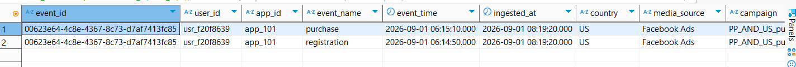

```sql
row_number() OVER (
    PARTITION BY event_id
    ORDER BY ingested_at DESC, event_time DESC
) AS order_event_ingested
```

### Task 2.2 — Window functions

With WHERE filter:

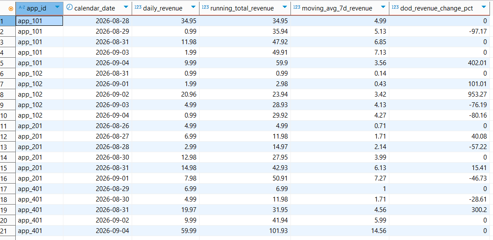

Without WHERE filter:

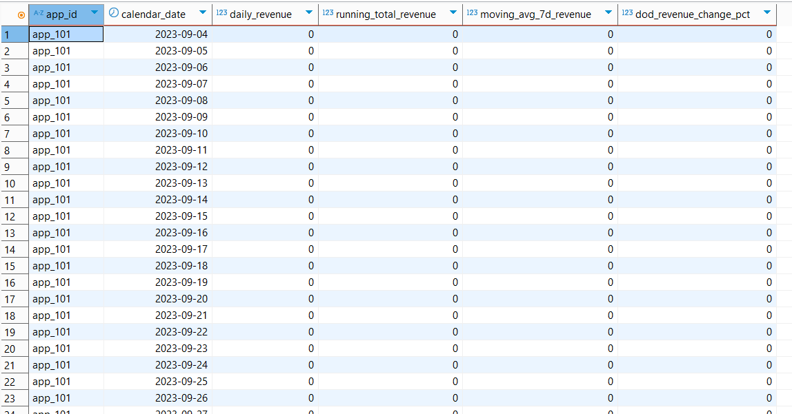

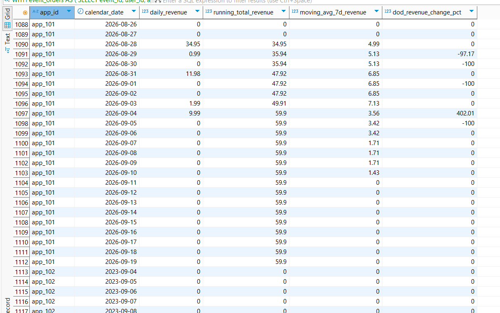

> **Explain:** days with no events at all are missing from your output. Does that matter for the 7-day moving average? If it does, describe (no code needed) how you would fix it.

Yes, days with no events do matter for the 7-day moving average. When we query a window function with ROWS BETWEEN 6 PRECEDING AND CURRENT ROW, SQL evaluates physical rows, not calendar time, so if we have missing events, SQL averages across the last 6 *active event rows*, which could span weeks or months, thus resulting in incorrect calculations.

For this task I decided to create a static dates table with an interval of 1 day, that starts from the minimum value of the app launch date to this day, so the calculations for the 7-day moving average will not break.

```sql
CREATE TABLE IF NOT EXISTS mobile_analytics.calendar AS
SELECT generate_series(min(launched_on), now(), INTERVAL '1 day')::DATE AS calendar_date
FROM mobile_analytics.apps;
```

It may not be the most optimized way, as when we run the script it may consume resources, especially with the cross join we have.

We could have used RANGE, but after some research I realized it was going to mess with the LAG, and would only do the calculations across active event days.

### Task 2.3 — Joining costs

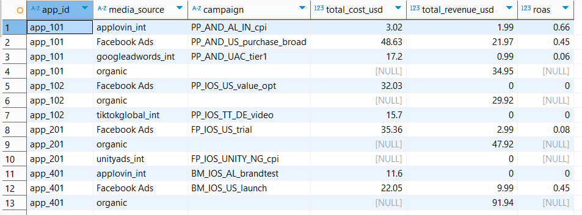

> **Explain:** there are campaigns with cost and no revenue, and campaigns with revenue and no cost. Which join did you choose and what does each of those two cases mean for the business? What did you do about division by zero?

- campaign_costs LEFT/RIGHT JOIN events_raw - would drop data from one side
- campaign_costs LEFT/RIGHT JOIN events_raw - would drop any campaign that had cost without revenue or revenue without cost
- FULL JOIN - includes all data from both tables.

Campaigns with cost and NO revenue - the campaign is actively spending marketing budget, but users acquired through it have not made any purchases or monetized events yet.

Campaigns with revenue and NO cost - revenue is being generated by users attributed to a campaign, but there is no recorded spend in the ad spend logs, usually attributed to the organic traffic.

To prevent division-by-zero errors, I used NULLIF(cost_usd, 0.00). When cost is 0, SQL converts it to NULL and returns NULL for ROAS. This keeps the query safe from crashes while accurately representing that ROAS is undefined when there is no ad spend.

I decided to keep the NULL values, because what if the campaign only started and we haven't received any revenue, so I thought it would be better to keep it as NULL rather than 0, it might be confusing that our campaign brings us 0 usd.

### Task 2.4 — Incremental load

After the first run I created a snapshot of the clean table to be able to compare them with the 2nd run:

```sql
CREATE TABLE mobile_analytics.clean_snapshot AS
SELECT *
FROM mobile_analytics.events_raw_clean;
```

Updated rows:

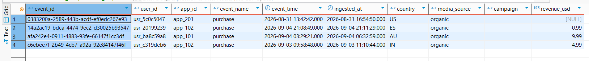

After new data ingestion:

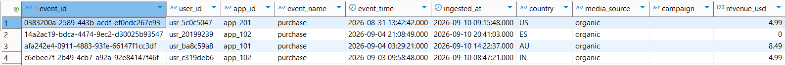

- The ingested_at has been changed for all these rows
- revenue_usd has been added to the first row
- revenue_usd has been changed to 0 for the second row
- revenue_usd has been changed for the third row

Re-running the ingestion doesn't result in duplication.

These are newly ingested rows:

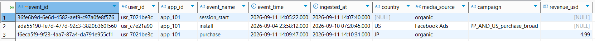

> **Explain:** which time column do you filter on to pick up new rows — event_time or ingested_at — and why? What is the smallest window you can reload without losing late events, and what does that choice cost you?

**event_time** records when an action occurred on a user's device, whereas **ingested_at** records when your backend system actually received and processed the data. If a mobile app goes offline or experiences network latency, events that occurred days ago (event_time) might only arrive in your database today (ingested_at). If you filter your incremental batch on event_time, you will permanently miss those late-arriving events because their event_time falls outside your current processing window. Filtering on ingested_at guarantees you capture every newly arrived record during the run in which it lands, regardless of how old the event actually is.

**Smallest window:** everything after the last loaded `MAX(ingested_at)`

**If you choose a window that is too small: Data loss and missing corrections.** Late-arriving events that exceed your short lookback window will be permanently ignored by the incremental loader.

**If you choose a window that is larger/safer: Higher compute cost and longer execution time.** Re-reading and deduplicating a larger lookback buffer on every incremental run increases memory overhead, I/O operations, and query execution times.

## 3. Python

### Task 3.1 — Cleaning (required)
This task has no "Explain" part.

### Task 3.2 — A small pipeline

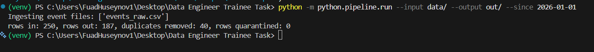

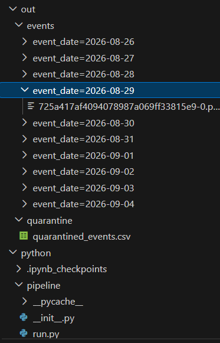

> **Explain:** in three or four sentences, what your script does if it dies half-way through writing the output, and what you would change to make that safe.

If the script dies halfway through execution, `df_clean.to_parquet()` will leave partially written, corrupted, or uncommitted Parquet partition files on disk, while `quarantined_events.csv` may remain either outdated or uncreated. Because PyArrow writes directly to the destination directory, downstream tools reading `out/events` could ingest incomplete or duplicate batches if a failed run is not manually cleaned up.

To make this crash-safe (atomic), you should write all Parquet partitions and the quarantine CSV into a temporary staging folder first (e.g., `out/.tmp_run/`). Once all files are written and validated successfully, atomically swap or move the staging directory to the target `out/` path using `os.replace()` or `shutil.move()`, ensuring downstream consumers only ever see complete, fully committed outputs.

### Task 3.3 — Reading someone else's code

> List the problems you see — correctness, performance, robustness — ranked by how much they matter. Rewrite the function. You do not need to keep the same signature; if you change it, say why.

Ranked:

1. ```python
   totals = {}

   for i, row in df.iterrows():
       key = row["app_id"] + "-" + row["media_source"]
       totals[key] = totals.get(key, 0) + row["revenue_usd"]
   return pd.DataFrame([{"key": k, "revenue": v} for k, v in totals.items()]).sort_values("revenue", ascending=False)
   ```

   This part of the code has performance issues and robustness issues, we iterate through all rows of the dataframe, and we use a risky key name - if either of these columns returns a missing value (NaN) the script will crash.

2. ```python
   df["revenue_usd"] = df["revenue_usd"].astype(float)
   ```

   The transformation has some flaws, revenue_usd might be empty, comma instead of dot, NULL, ' '

3. ```python
   df = df[df.event_time.str.startswith(day)]
   ```

   It will not work if our event_time is datetime type, it is only going to work if the event_time is a string.

4. Also we might wanna pass a dataframe into the function instead of the whole CSV file.

Rewritten function:

```python
import pandas as pd


def load_daily(df, day):
    df['event_time'] = pd.to_datetime(df['event_time'], errors='coerce', utc=True)
    df_day = df[df['event_time'].dt.strftime('%Y-%m-%d') == day].copy()
    if df_day.empty:
        return pd.DataFrame(columns=['key', 'revenue'])

    cleaned_strings = (
        df_day["revenue_usd"].astype(str).str.replace(",", ".").str.strip()
    )
    convert_dt = pd.to_numeric(cleaned_strings, errors="coerce")  # forcing unparseable text/empty values to NaN
    df_day['revenue_usd'] = convert_dt.fillna(0.0)
    # Create the key column explicitly before grouping
    df_day['key'] = df_day['app_id'].astype(str) + '-' + df_day['media_source'].astype(str)
    df_result = (
        df_day.groupby('key')['revenue_usd']
        .sum()
        .reset_index(name='revenue')
        .sort_values(by='revenue', ascending=False)
    )
    return df_result


if __name__ == "__main__":
    file_path = 'data/events_raw.csv'
    day = '2026-09-01'

    try:
        print(f"Loading data from {file_path}...")
        df_raw = pd.read_csv(file_path)
    except Exception as e:
        print(f"Failed to read CSV: {e}")
        df_raw = pd.DataFrame()

    if not df_raw.empty:
        df_result = load_daily(df_raw, day)
        print(df_result)
```

## 4. Modelling and design

### 4.1 Star schema

> Sketch a star schema for this data: name the fact table, its grain, its measures, and the dimensions. State the grain in one sentence, explicitly.

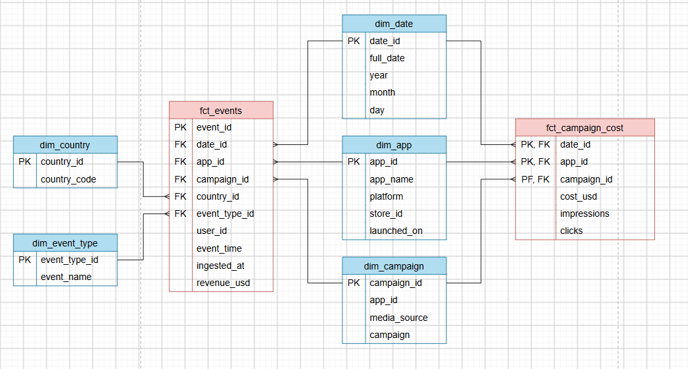

- Fact table: `fct_events`
- Grain: one row per unique event (`event_id`), using its latest delivery and excluding test events.
- Measures: `revenue_usd` (the number of events is a count of rows).
- Dimensions: `dim_date`, `dim_app`, `dim_campaign`, `dim_country`, `dim_event_type`.

- Second fact table: `fct_campaign_cost`. 
- Grain: one row per app, media source, campaign and day. 
- Measures: `cost_usd`, `impressions`, `clicks`. 
- Dimensions: It shares `dim_date`, `dim_app` and `dim_campaign` with `fct_events`.

### 4.2 A dimension that changes

> A campaign is renamed mid-flight. Yesterday's report was built under the old name. Describe what you would do so that historical numbers stay correct while new rows use the new name, and say what that costs you in query complexity.

In this scenario we can use SCD2 (slowly changing dimension type 2). If we want to save the full history, so that we can see the old rows, new rows, when the row was active (start_dt, end_dt), so we can just add a new row for the new campaign name.

For our dim_campaign we would add:

- campaign_scd_id - an id that stays the same after a rename
- start_dt and end_dt - the dates when the row was valid
- is_active - true for the newest version and false for the old one

Query complexity

- One campaign is now several rows. Grouping by campaign_id splits a renamed campaign into two lines. To see it as one, group by campaign_scd_id.
- Old rows with the current name need extra work. If a report must show the new name on old rows, you join once more to the row where is_active = true, using campaign_scd_id.
- A missing filter causes double counting. If you join on campaign_scd_id and forget is_active = true, every fact row is repeated once per version.
- Storage and speed barely change, because the dimension grows by a few rows per rename.

### 4.3 Idempotency

> Explain idempotency to a marketing manager who does not write code, in three sentences. Then explain to an engineer why an INSERT ... SELECT into a daily table is not idempotent and what the usual fixes are.

Idempotency means that running the same data update twice gives exactly the same result as running it once. It matters because updates sometimes fail halfway or have to be re-run, and without idempotency yesterday's revenue could be counted twice. With it, we can safely re-run any update at any time, and the numbers in your report stay correct.

An INSERT ... SELECT only appends rows, so re-running it for the same day inserts the same rows again. The most common fix is to delete (or overwrite) that day's rows and insert them again inside one transaction, so the run replaces the day instead of adding to it. The second fix is an upsert with a unique key, such as INSERT ... ON CONFLICT (event_id) DO UPDATE or MERGE, ideally with an ingested_at guard so an older row cannot overwrite a newer one.

### 4.4 Late data

> An event happened on Monday and arrives on Thursday. Monday's report has already been sent to the client. Walk through what your pipeline does and what you tell the client.

On Thursday the event arrives with Monday's event date, so my pipeline loads it into the clean table. It doesn't create duplicates, because each event has a unique ID. The event is counted under Monday, so Monday's numbers go up a little. I compare the new Monday numbers with the report we already sent, to see exactly what changed. Then I tell the client that a late event changed Monday's numbers, and I send the corrected report and keep the old one.

### 4.5 Partitioning

> You are asked to partition the fact table. Which column do you partition on, and why that one rather than the obvious alternative? Name one query pattern your choice makes slower.

I would partition the fact table by the event date (event_time), with one partition per month. The database can then skip all the other partitions and read much less data. The obvious alternative is ingested_at, because our loads use it. But then a late event would land in a new partition, far from the other events of its day, so a daily report would have to read many partitions. A query this makes slower is the incremental load, which looks for new rows by ingested_at. New rows can be inside any old partition, so it has to check all of them.

## 5. Debugging scenario

> Monday morning. The daily revenue dashboard shows 0 for Sunday for one app out of twelve. The pipeline reported success. Nobody deployed anything over the weekend.
> Write, in order, the first five things you check — and for each one, say what a yes and a no would tell you.

1. Is the Sunday number also wrong in the mart table for this app? Yes --> the dashboard is fine and the data is wrong earlier, so I go to step 2. No --> the problem is in the dashboard (filter, time zone), so I fix it.
2. Is there raw data for this app on Sunday? I count rows and revenue by app and event date. Yes --> the data arrived and was lost or changed in our steps, so I go to step 3. No --> nothing arrived, so I go to step 5.
3. Do the row counts stay the same from raw to staging to marts? Success doesn't prove rows were processed. Yes --> the rows survive, so the values are the problem, so I go to step 4. No --> I find the layer where the count drops, and check its filters and joins (test flag, duplicates, join to the apps table).
4. Are the revenue values usable? I look for empty values, NULL, comma, or a wrong test flag. Yes, they are bad --> a format change in the source, or a bug in cleaning for this app. No, they look normal --> I go back to step 3 and look at that layer's logic.
5. Did the data come late, and is it also missing for the other apps? I compare ingested_at with event_time. Late data exists --> the pipeline ran before it arrived, so I re-run and widen the late-data window. No data at all, and the other 11 apps are fine --> the source problem is only for this app (vendor, SDK, or a changed app_id), so I contact the vendor or the app team. If the other apps are also wrong --> the whole ingestion is broken.
