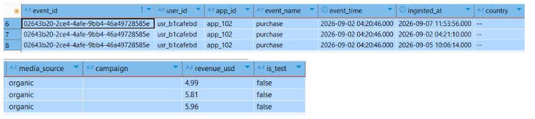
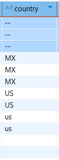
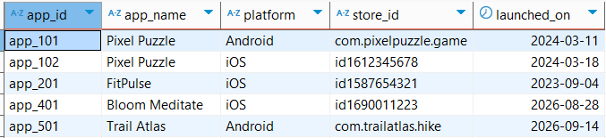
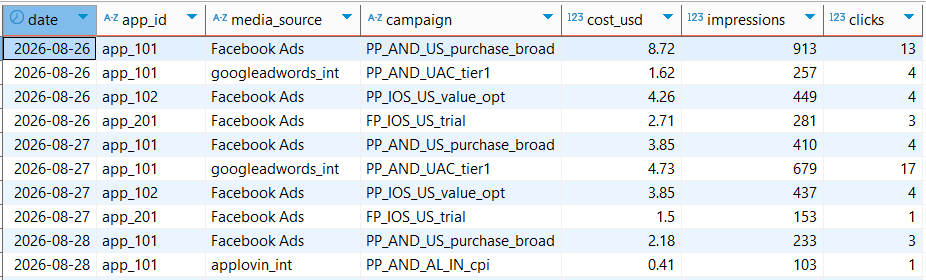
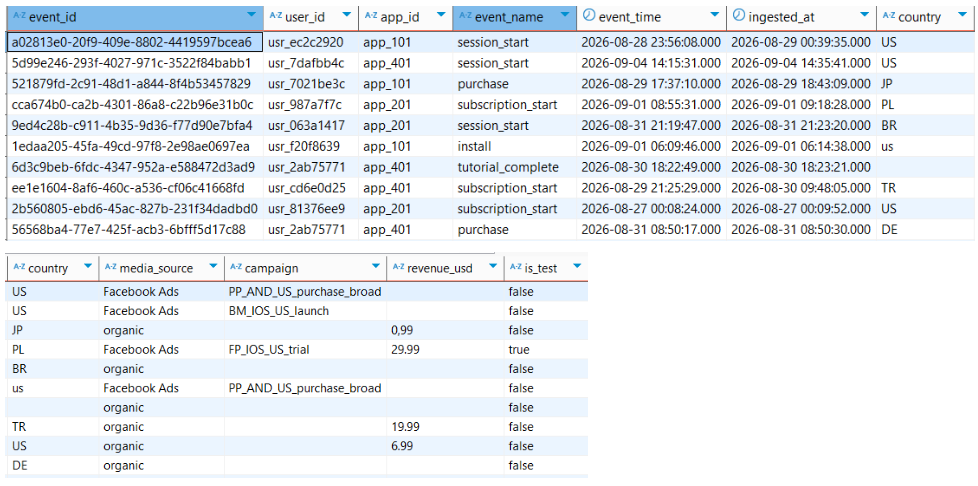

# ASSUMPTIONS

## Setup

1. Create a folder
2. Create a virtual environment - python -m venv venv
3. Activate it venv\Scripts\Activate.ps1
4. Add .gitignore and put venv/ there
5. Create requirements.txt
6. Run pip install -r requirements.txt
7. Now we will create datasets, then DDL in PostgreSQL and load the datasets into those tables
8. Checking datasets with the requirements:

- The vendor may deliver the same event_id more than once. Repeated deliveries can differ in ingested_at and, occasionally, in revenue_usd — the vendor corrects revenue after the fact.
- event_time is UTC. ingested_at is UTC. They can differ by up to several days for late-arriving mobile events.
- country is sometimes an empty string, sometimes '--', sometimes lowercase.
- revenue_usd is a string in the CSV and may contain '', 'NULL' or a comma decimal separator.
- Rows with is_test = true come from internal QA devices and must never reach reporting.

Checked against the generated data:





## PostgreSQL DDL

```sql
CREATE SCHEMA IF NOT EXISTS mobile_analytics;

CREATE TABLE IF NOT EXISTS mobile_analytics.events_raw (
    event_id TEXT,
    user_id TEXT,
    app_id TEXT,
    event_name TEXT,
    event_time TIMESTAMP,
    ingested_at TIMESTAMP,
    country TEXT,
    media_source TEXT,
    campaign TEXT,
    revenue_usd TEXT,
    is_test TEXT
);

CREATE TABLE IF NOT EXISTS mobile_analytics.campaign_costs (
    date DATE,
    app_id TEXT,
    media_source TEXT,
    campaign TEXT,
    cost_usd DECIMAL(10, 2),
    impressions INT,
    clicks INT
);

CREATE TABLE IF NOT EXISTS mobile_analytics.apps (
    app_id TEXT,
    app_name TEXT,
    platform TEXT,
    store_id TEXT,
    launched_on DATE
);
```

Then we load the data in DBeaver --> Import Data.

Data samples:







## Assumption — Task 2.4, incremental load

I had 1 question with this task:

1. Is it correct that first we need to deduplicate and insert our events_raw into the clean table, since events_raw has duplicates (from the table explanation), and after that incrementally insert our second dataset. And in this case our event_id would become a unique key (Primary Key) based on what we will decide the uniqueness of the row?

For me, I will deduplicate the data and assume that event_id is the primary key.

So I am gonna follow this logic:

- New events (event_id not in clean table) get inserted.
- Corrected events (event_id already in clean table) get updated.

Also we had 2 options: UPSERT (INSERT INTO ... ON CONFLICT) and MERGE, I used UPSERT.

I will remove is_test, since it will be false anyway.

## Not finished

- Task 2.5 — Data quality checks (optional): not done, ran out of time.
